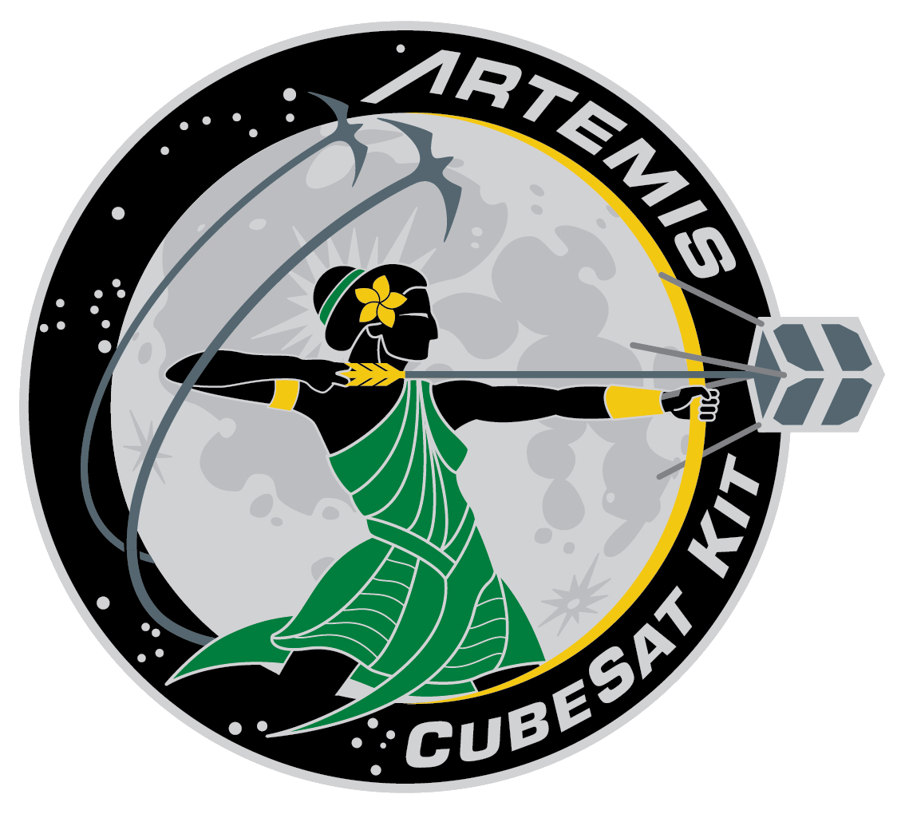

   

# Artemis Cubesat Kit Ground Station Test Software (Teensy 4.1)

This repository contains the ground station software designed to run on the Artemis Cubesat Kit's test ground station board. 

This software is not designed to be used for flight, it is merely designed to be a testing tool. 

For documentation and tutorials, visit our [project website](https://sites.google.com/hawaii.edu/artemiscubesatkit).
